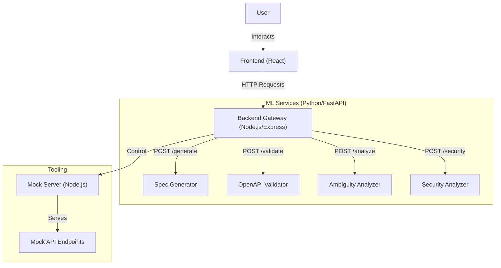

# API Gen - AI-Powered API Architect

**API Gen** is an advanced developer platform that leverages Artificial Intelligence to convert natural language requirements into production-ready **OpenAPI 3.0+ specifications**. It acts as an intelligent architect, helping teams reduce ambiguity, ensure security, and accelerate development cycles by automating the API design process.

---

## 🚀 Features

- **Natural Language to OpenAPI**: Describe your API in plain English, and let the AI generate a complete, standard-compliant OpenAPI specification.
- **Ambiguity Analysis**: analyzing your requirements to detect vague or missing details and generates clarification questions.
- **Automated Validation**: Ensures generated specifications strictly adhere to OpenAPI standards using `openapi-spec-validator`.
- **Security Scanning**: specialized AI models analyze the specification for potential security vulnerabilities (OWASP Top 10) and design flaws.
- **Interactive Editor**: A built-in Monaco Editor allows for manual refinement of the generated YAML/JSON.
- **Real-time Visualization**: integrated Swagger UI to visualize and test the API specification instantly.
- **Mock Server Generation**: Spin up a live mock server based on your generated specification to start frontend development immediately.
- **Split-Pane Workspace**: A modern, IDE-like interface with split views for Requirements, Editor, Validation, and Analysis.

---

## 🏗 Architecture

API Gen follows a **Microservices Architecture** to ensure modularity, scalability, and separation of concerns.



### Components

1.  **Frontend**: A React application built with Vite, featuring a rich UI with Monaco Editor and Swagger UI.
2.  **Backend Gateway**: A Node.js Express server that acts as the orchestrator, routing requests to appropriate microservices.
3.  **ML Services**: A collection of Python FastAPI services powered by LLMs (Google Gemini) and static analysis tools.
    -   **Spec Generator**: Generates OpenAPI specs from text.
    -   **Ambiguity Analyzer**: Identifies gaps in requirements.
    -   **OpenAPI Validator**: Validates spec syntax.
    -   **Security Analyzer**: Detects security risks.
4.  **Mock Server**: A dynamic Node.js server that can spin up routes based on the provided OpenAPI spec.

---

## 🛠 Tech Stack

### Frontend
-   **Framework**: React 19
-   **Build Tool**: Vite
-   **Styling**: Vanilla CSS (SaaS-style Dark Theme), Lucide React (Icons)
-   **Editor**: @monaco-editor/react
-   **Visualization**: swagger-ui-react

### Backend & Tooling
-   **Runtime**: Node.js
-   **Framework**: Express.js
-   **Utilities**: Axios (HTTP Client), Dotenv

### ML & AI Services
-   **Language**: Python 3.10+
-   **Framework**: FastAPI, Uvicorn
-   **AI Model**: Google Gemini 2.5 Flash (`google-genai`)
-   **Validation**: `openapi-spec-validator`, `pydantic`

---

## 📦 Installation & Setup

### Prerequisites
-   **Node.js** (v18 or higher)
-   **Python** (v3.10 or higher)
-   **npm** or **yarn**
-   **Google Gemini API Key** (Required for AI features)

### 1. Clone the Repository
```bash
git clone https://github.com/yourusername/api-generator.git
cd api-generator
```

### 2. Backend Setup
```bash
cd backend
npm install
```
Create a `.env` file in the `backend` directory:
```env
PORT=5000
SPEC_GENERATOR_URL=http://localhost:8000
OPENAPI_VALIDATOR_URL=http://localhost:8001
AMBIGUITY_ANALYZER_URL=http://localhost:8002
SECURITY_ANALYZER_URL=http://localhost:8003
MOCK_SERVER_URL=http://localhost:3000
```
Start the backend:
```bash
npm start
```

### 3. Frontend Setup
```bash
cd ../frontend
npm install
```
Start the frontend development server:
```bash
npm run dev
```
Access the UI at `http://localhost:5173`.

### 4. ML Services Setup
Navigate to `ml-services` and set up a virtual environment:
```bash
cd ../ml-services
python -m venv venv
source venv/bin/activate  # On Windows: venv\Scripts\activate
pip install -r requirements.txt
```
**Running the Services:**
You need to run each service individually or use a process manager.
Ensure you set the `API_ARCHITECT_GEMINI_KEY` environment variable for the Spec Generator.

**Window Terminals (Example):**
```powershell
# Spec Generator (Port 8000)
$env:API_ARCHITECT_GEMINI_KEY="your_api_key_here"
uvicorn spec_generator.main:app --port 8000 --reload

# OpenAPI Validator (Port 8001)
uvicorn openapi_validator.main:app --port 8001 --reload

# Ambiguity Analyzer (Port 8002)
uvicorn ambiguity_analyzer.main:app --port 8002 --reload

# Security Analyzer (Port 8003)
uvicorn security_analyzer.main:app --port 8003 --reload
```

### 5. Mock Server Setup
```bash
cd ml-services/mock_server
npm install
node server.js
```
Runs on `http://localhost:3000`.

---

## 📖 Usage Guide

1.  **Define Requirements**: Open the web interface and enter your API requirements in the "Input" tab. Be descriptive (e.g., "Create a user management API with login, registration, and profile update endpoints").
2.  **Generate**: Click the **"Generate API Spec"** button. The system will process your request:
    -   Analyze for ambiguity.
    -   Generate the OpenAPI spec.
    -   Validate the output.
    -   Scan for security issues.
3.  **Review & Edit**:
    -   **Editor**: View and edit the generated YAML/JSON in the "Editor" tab.
    -   **Preview**: See the interactive documentation in the "Preview" tab.
    -   **Security**: Check the "Security" tab for any warnings.
4.  **Test**: Click **"Start Mock Server"**. The system will provision a temporary API based on your spec. You can now make real HTTP requests to the mock endpoints.

---

## 📂 Project Structure

```text
api-generator/
├── backend/                 # Node.js Gateway
│   ├── src/
│   │   ├── routes/          # API Routes (generate, mock)
│   │   └── app.js           # Express App Setup
│   └── package.json
├── frontend/                # React Application
│   ├── src/
│   │   ├── components/      # UI Components
│   │   ├── pages/           # Application Pages
│   │   ├── services/        # API Client Services
│   │   └── content/         # Static Content (e.g., Guide)
│   └── package.json
├── ml-services/             # Python Microservices
│   ├── spec_generator/      # LLM-based Spec Generation
│   ├── openapi_validator/   # Schema Validation Service
│   ├── ambiguity_analyzer/  # Requirement Analysis Service
│   ├── security_analyzer/   # Security Auditing Service
│   └── mock_server/         # Node.js Mock Server (Located here for logical grouping)
└── README.md                # Project Documentation
```

---

## 🤝 Contributing

Contributions are welcome! Please follow these steps:
1.  Fork the repository.
2.  Create a feature branch (`git checkout -b feature/AmazingFeature`).
3.  Commit your changes (`git commit -m 'Add some AmazingFeature'`).
4.  Push to the branch (`git push origin feature/AmazingFeature`).
5.  Open a Pull Request.

---

## Vision

API Gen is designed to be **production-oriented, modular, and extensible**, making it suitable for real-world API development and enterprise-scale workflows.

The long-term goal is to evolve API Gen into a full AI-assisted API design, validation, and delivery platform.